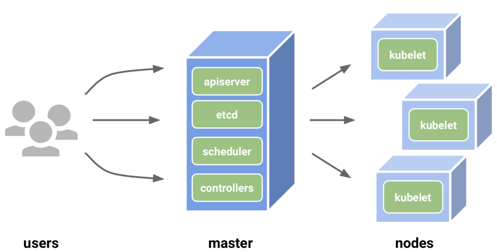
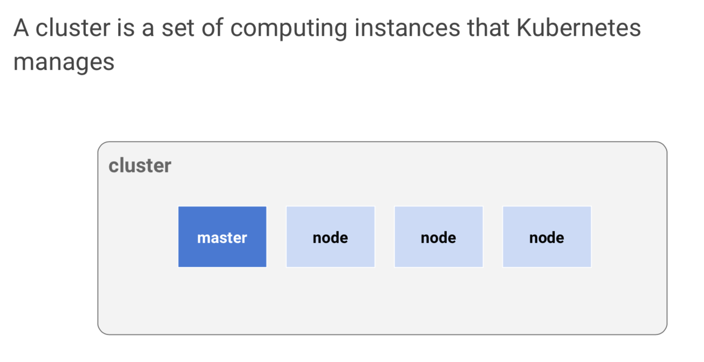
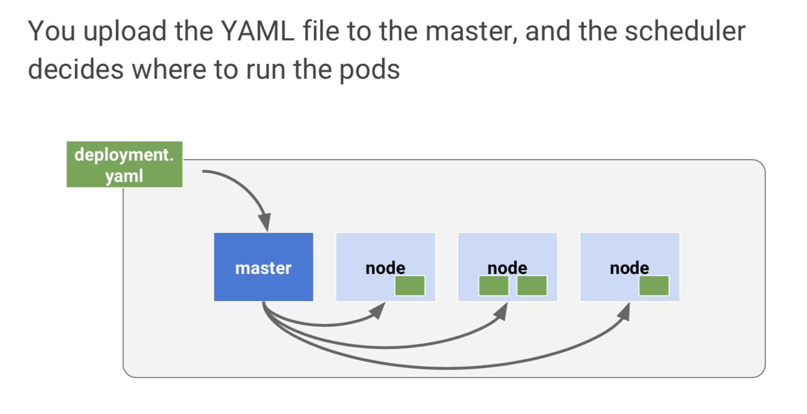
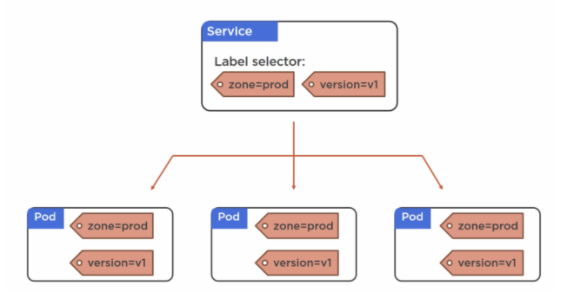

# Kubernetes in a Nutshell

## Table of Content
<!-- TOC depthFrom:3 -->

- [Architecture](#overview)
  * [Cluster, Master and Nodes](#clusters)
- [Pods](#pods)
  * [Pods vs. Containers](#pods_containers)
  * [Microservices and Pods](#microservices_containers)
  * [Deployment of Pods](#deployment_of_pods)
  * [Intra-Pod communication](#intra_pod)
  * [Pods and Control Groups](#cgroups)
- [Deployment](#deployment)
  * [Declarative Model](#declarative_model)
- [Services](#services)
  * [Labels and Selectors](#lables)


<a name="overview"></a>
## Architecture

<table><tr><td>

</td></tr></table>

#### API Server
* "frontdoor" into Kubernetes
* secure RESTful API that we we POST YAML configuration files (or manifest files)
* YAML files are validated, persisted in cluster store and deployed to cluster

#### Cluster Store - etcd
* represents persistent memory of the clusters
* stores the entire configuration and state of the clusters
* etcd - Distributed database [https://coreos.com/etcd/][4507be7f]

  [5a47b916]: https://coreos.com/etcd/ "etcd"
  [4507be7f]: https://coreos.com/etcd/ "https://coreos.com/etcd/"

<a name="clusters"></a>
### Cluster, Master and Nodes

<table><tr><td>

</td></tr></table>


<table><tr><td>

</td></tr></table>


<a name="pods"></a>
## Pods - _"It's all about Pods"_
A Pod is an atomic unit of deployment in K8S.

1. Virtualization does VM's
2. Docker does containers
3. _**Kubernetes does Pods**_

<a name="pods_containers"></a>
### Pods vs. Containers
- containers run in Pods (>= 1 container per Pod)
- Pods are a shared execution environment for one or more containers
  - shared resources are IP addresses, ports, hostname, sockets, memory, volumes, routing table etc.
- kind of  wrapper around a container or a special kind of containers
- multi-containers Pods useful for >1 containers sharing resources i.e. logging and service meshes
- more common are single-container Pods

<a name="microservices_containers"></a>
### Microservices and Pods
One concern for one container i.e. one container for web-service and one container for file-sync service

<a name="deployment_of_pods"></a>
### Deployment of Pods
- to deploy we define a _manifest file_ and post that file to the API server

<a name="intra_pod"></a>
### Intra-Pod communication
- every Pod can talk directly to every other Pod
- two containers in one Pod communicate via _localhost_ interface

<a name="cgroups"></a>
### Pods and Control Groups (cgroups)
- _cgroups_ stop conatiners to consume all available CPU, RAM and IOPS on a node (Kind of Police)
- each container within a Pod can have their own cgroup limits

<a name="deployment"></a>
## Deployment
- Deployments bring self-healing, scalability, rolling updates and rollbacks
- manages just a set of identical Pods
  - Pod-1 for frontend => Deployment-1
  - Pod-2 for backend => Deployment-2
- Deployments leverages another object called **ReplicaSet**
- **ReplicaSet** manage Pods

_**kind: Deployment**_
  ```
  controllers/nginx-deployment.yaml  
  apiVersion: apps/v1
  kind: Deployment
  metadata:
    name: nginx-deployment
    labels:
      app: nginx
  spec:
    replicas: 3
    selector:
      matchLabels:
        app: nginx
    template:
      metadata:
        labels:
          app: nginx
      spec:
        containers:
        - name: nginx
          image: nginx:1.15.4
          ports:
          - containerPort: 80
  ```
Creating a Deployment:
```
  kubectl create -f nginx-deployment.yaml
  kubectl get deployments
```

<a name="declarative_model"></a>
### Declarative Model
- Desired state - Desired state is what you want.
- Current state - Current state is what you have.

The Declarative model is a way of telling Kubernetes what our desired state is, without getting into the detail of how to implement it. Kubernetes is constantly checking whether _current state_ matches _desired state_.

<a name="services"></a>
## Services

* Kubernetes Service is an abstraction which defines a logical set of Pods and a policy by which to access them
* Services adds reliability to Pods IPs, DNS and Ports through _label selection_
* Clients will talk to services and the service dispatches the requests to Pods
* Services also provide load-balancing

_**kind: Service**_
```
kind: Service
apiVersion: v1
metadata:
  name: my-service
spec:
  selector:
    app: MyApp
  ports:
  - protocol: TCP
    port: 80
    targetPort: 9376
```

<a name="lables"></a>
### Lables and Selectors

Pods and Services are loosely coupled via _labels_ and _label selectors_.
<table><tr><td>

</td></tr></table>
